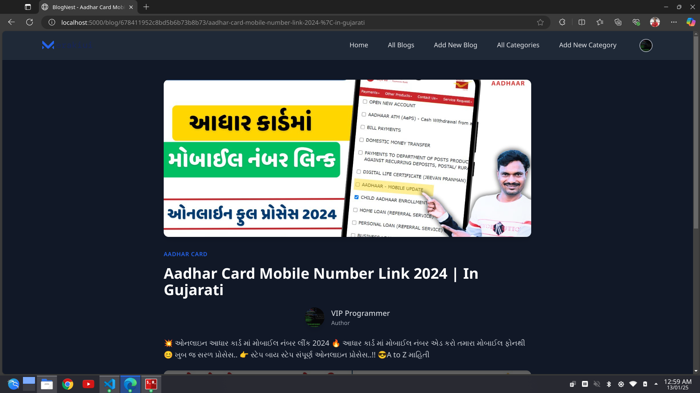

# BlogNest

BlogNest is a modern and efficient blogging platform designed for simplicity and performance. Built using Node.js, Express.js, EJS, MongoDB, and styled with Tailwind CSS, it empowers users to create, edit, and manage blogs with ease. The platform supports both desktop and mobile browsers, ensuring a seamless experience across devices.

## Features

### Admin Functionality

- **Authentication**: Secure login and logout for a fixed admin account.
- **Dashboard**: Comprehensive overview of all blogs and categories.
- **Blog Management**:
    - List all blogs in a table displaying Title, Category, Description, and Actions (Edit/Delete).
    - Create new blogs with:
        - Fields: Title, Category (dropdown), Description (rich text editor), Publish Date.
        - Auto-generated slug in the format `/id/titleslug` for SEO-friendly URLs.
        - Support for uploading thumbnails and featured images, stored in Cloudinary.
        - Embedded YouTube video links.
    - Edit and delete existing blogs.
- **Category Management**:
    - List all categories with Name and Actions (Edit/Delete).
    - Add new categories using a simple form.

### User Features

- **Homepage**: Displays the latest blogs in a user-friendly layout.
- **Blog Details**: Accessible via SEO-friendly URLs (`/id/titleslug`). View detailed content with embedded YouTube videos.
- **Search**: Search blogs by title for quick access.
- **Authentication**: Google login for user accounts.
- **Interaction**:
    - Commenting system to engage with blog content.
    - Tagging system for categorizing and filtering blogs.

### Responsive Design

Tailored for both desktop and mobile devices using Tailwind CSS, ensuring a visually appealing and consistent interface.

## Technologies Used

### Frontend

- EJS (Embedded JavaScript Templates)
- Tailwind CSS

### Backend

- Node.js, Express.js

### Database

- MongoDB with Mongoose

### Authentication

- JSON Web Tokens (JWT)
- Google OAuth

### Cloud Storage

- Cloudinary for storing and managing image assets (thumbnails and featured images).

## Installation Guide

### Clone the Repository:

```bash
git clone https://github.com/yourusername/BlogNest.git
```

### Navigate to the Project Directory:

```bash
cd BlogNest
```

### Install Dependencies:

```bash
npm install
```

### Set Up Environment Variables:

Create a `.env` file in the root directory and add the following variables:

```env
PORT=5000
MONGO_URI=mongodb://localhost:27017/blognest

GOOGLE_CLIENT_ID=your_google_client_id
GOOGLE_CLIENT_SECRET=your_google_client_secret
GOOGLE_CALLBACK_URL=http://localhost:5000/auth/google/callback

JWT_SECRET=your_jwt_secret

CLOUDINARY_CLOUD_NAME=your_cloudinary_cloud_name
CLOUDINARY_API_KEY=your_cloudinary_api_key
CLOUDINARY_API_SECRET=your_cloudinary_api_secret
```

### Start the Development Server:

```bash
npm run dev
```

### Access the Application:

Open your browser and navigate to `http://localhost:5000`.

## Screenshots

### Authentication


### Home (user)


### Blog


### Add Blog (admin)


### Blog List (admin)


### Category List (admin)


### Profile


## Contributing

Contributions are welcome! To get started:

1. Fork the repository.
2. Create a feature branch:
     ```bash
     git checkout -b feature-name
     ```
3. Commit your changes:
     ```bash
     git commit -m "Add feature description"
     ```
4. Push to the branch:
     ```bash
     git push origin feature-name
     ```
5. Open a pull request.

## License

This project is licensed under the MIT License. See the [LICENSE](LICENSE) file for details.

## Contact

For questions or suggestions, feel free to open an issue or contact the project maintainer at malamharid@gmail.com.